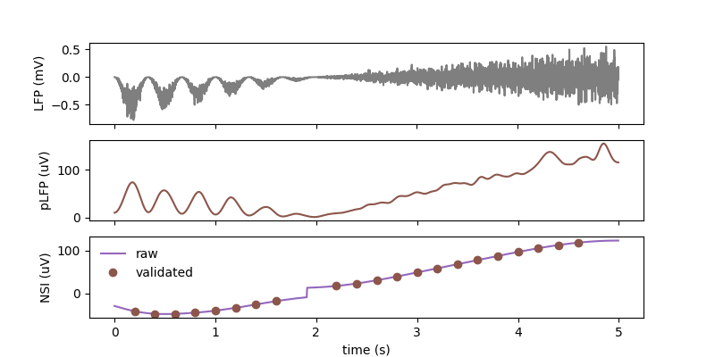
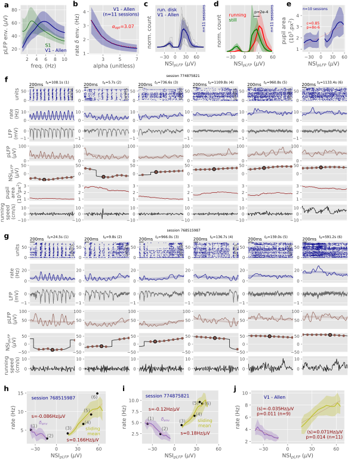

# Network State Index (NSI)

#### Classifying Network State from LFP in Neocortex 

This module provides a quantitative characterization of network states in neocortex from extracellular signals. It implements the analysis described in the following article (please cite if you use this code !):
> Network States Classification based on Local Field Potential Recordings in the Awake Mouse Neocortex
> Yann Zerlaut, Stefano Zucca, Tommaso Fellin, Stefano Panzeri
> bioRxiv 2022.02.08.479568; doi: [10.1101/2022.02.08.479568](https://doi.org/10.1101/2022.02.08.479568)


## Installation

1. Install a python distribution for scientific analysis, e.g. get the [latest Miniconda distribution](https://docs.conda.io/en/latest/miniconda.html) and install it.
   
2. Run the following in the [Anaconda prompt](https://docs.anaconda.com/anaconda/user-guide/getting-started/#write-a-python-program-using-anaconda-prompt-or-terminal):

```
git clone https://github.com/yzerlaut/Network_State_Index.git
cd Network_State_Index
pip install .
```

If you do not wish to clone the repository you can also directly install the module with:
```
pip install git+https://github.com/yzerlaut/Network_State_Index
```


## Code description

The core of the implementation lies in the file: [nsi/functions.py](./nsi/functions.py). It makes use of the continuous wavelet trasnform to evaluate the time-varying high-gamma and delta envelopes. It implements the NSI formula and validation procedure.
 
## Usage

### Minimal demo

```
import numpy as np
import nsi # --- the NSI module ---

# -- let's build a fake LFP signal array (having the required features of an awake LFP signal)
tstop, dt, sbsmpl_dt = 5, 1e-3, 5e-3 # 10s @ 1kHz
t = np.arange(int(tstop/dt))*dt
oscill_part = ((1-np.cos(2*np.pi*3*t))*np.random.randn(len(t))+4*(np.cos(2*np.pi*3*t)-1))*\
    (1-np.sign(t-2))/2.*(2-t)/(tstop-2)
desynch_part = (1-np.sign(2-t))/2*(t-2)/(tstop-2)*2*np.random.randn(len(t))
LFP = (oscill_part+desynch_part)*.1 # a ~ 1mV ammplitude signal

# -- compute the pLFP first
t_pLFP, pLFP = nsi.compute_pLFP(1e3*LFP, 1./dt,
                                freqs = np.linspace(50,300,10),
                                new_dt=sbsmpl_dt,
                                smoothing=42e-3)
p0 = np.percentile(pLFP, 1) # first 100th percentile

# -- then compute the NSI from the pLFP
NSI = nsi.compute_NSI(pLFP, 1./sbsmpl_dt,
                      low_freqs = np.linspace(2, 5, 4),
                      p0=p0,
                      alpha=2.85)

# then validate NSI episodes
vNSI = nsi.validate_NSI(t_pLFP, NSI,
                        var_tolerance_threshold=20*p0) # here no noise so we increase the thresh

# let's plot the result
import matplotlib.pylab as plt
fig, ax = plt.subplots(3, 1, figsize=(12,4))
ax[0].plot(t, LFP, color=plt.cm.tab10(7))
ax[1].plot(t_pLFP, pLFP, color=plt.cm.tab10(5))
ax[2].plot(t_pLFP, NSI, color=plt.cm.tab10(4), label='raw')
ax[2].plot(t_pLFP[vNSI], NSI[vNSI], 'o', label='validated', lw=0, color=plt.cm.tab10(5))
ax[2].legend(frameon=False)

for x, label in zip(ax, ['LFP (mV)', 'pLFP (uV)', 'NSI (uV)']):
    x.set_ylabel(label)
    if 'NSI'in label:
        x.set_xlabel('time (s)')
    else:
        x.set_xticklabels([])
plt.show()
```

<p align="center">
  
</p>

Execute the above example by running: `python nsi/functions/py`

### Demo on the "Visual Coding - Neuropixels" dataset

As a demo for how to build an analysis pipeline based on the NSI, you can find our analysis of the Allen dataset in the [associated notebook](https://github.com/yzerlaut/Network_State_Index/blob/main/demo/Allen-Neuropixels-dataset.ipynb) (generating the figure below).

<p align="center">
  
</p>


## Troubleshooting / Issues

Use the dedicated [Issues](https://github.com/yzerlaut/Network_State_index/issues) interface of Github.


## Notes

My implementation of the continuous wavelet transform (`nsi.my_cwt`) is not particularly efficient... Any suggestions/ideas to improve this is very welcome :)
